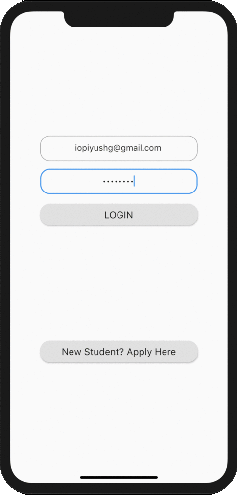

# University Registration System
  
This is the repository for a cross-platform app that facilitates the enrolment of the students into a university.   
The app supports the following functionalities:
- **New Enrollment**: The application allows new students to fill out an application form, that saves the data in the database and generates login credentials.

- **Maintain Details**: The app allows the administrator or the data entry operator to view, add, delete or edit details of students who have applied and the branches offered.

- **Report Generation**: Reports can be generated using the app. Currently supports some basic reports.

- **Additional Functionality**: Algorithm to allot seats can be implemented; currently allots seats at random. Students can view their submitted application and view the status of their application.

## Database
The app uses firebase for database management and authentication. Please email iopiyushg@gmail.com for the exact database schema. 

## Screenshots

### Editing a Branch Details

### New Application

